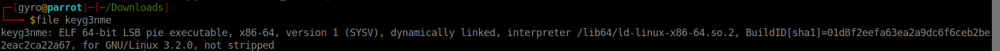
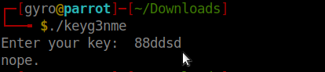
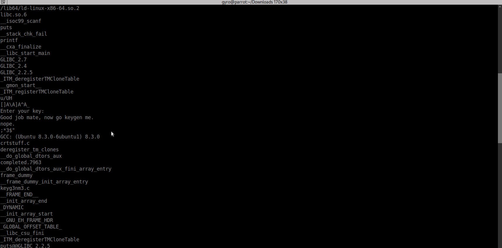
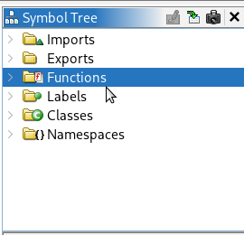
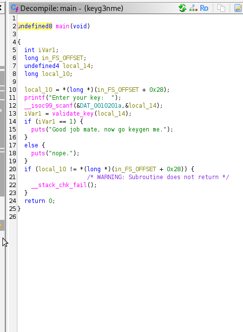
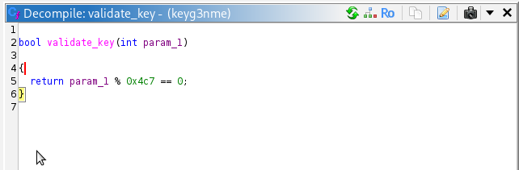
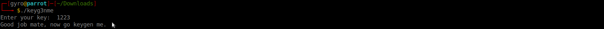

# CrackMe #1 - keyg3nme

## Challenge Information

- **Challenge:** keyg3nme
- **Difficulty:** Easy
- **Platform:** CrackMes.one
- **Objective:** Reverse engineer the binary to determine the correct activation key.

---

# Initial Recon

## File Identification

The first step was identifying the binary.

```bash
file keyg3nme
```

The output confirmed that the executable is a **64-bit ELF binary**.



---

## Running the Program

Executing the program without any analysis shows that it requests an activation key.

```bash
./keyg3nme
```

At this point we know the program validates a numeric input before granting access.



---

## Inspecting Strings

To gather quick information without opening a disassembler, I extracted printable strings.

```bash
strings keyg3nme
```

Interesting strings included:

Running the program prompts the user to enter an activation key. If the correct value is provided, the application displays
- "Good job mate, now go keygen me".
- Otherwise, it responds with "nope".
During the initial inspection, there were no hardcoded keys or obvious string comparisons (such as strcmp) that revealed the correct input, indicating that the key is generated or validated through internal program logic rather than being stored directly in the binary.
These strings indicate that the binary performs a simple validation routine.



---

# Static Analysis

The binary was imported into **Ghidra** for static analysis.

## Symbol Tree

The Symbol Tree revealed several useful functions, including:

- `main()`
- `validate_key()`

This immediately suggests that `main()` handles user interaction while `validate_key()` performs the actual verification.



---

## Analyzing main()

The decompiled `main()` function shows that the program:

1. Prompts the user for an activation key.
2. Reads the integer entered by the user.
3. Passes that value to `validate_key()`.
4. Prints **Correct!** or **Wrong!** depending on the return value.



---

## Analyzing validate_key()

The validation routine contains the core logic:

```c
return input % 1223 == 0;
```

This means the program checks whether the supplied number is evenly divisible by **1223**.

Any integer that is a multiple of **1223** satisfies the condition.



---

# Solution

The smallest valid activation key is:

```
1223
```

Running the binary with this value successfully activates the program.



---

# Key Takeaways

- Begin with quick reconnaissance using `file` and `strings`.
- Use Ghidra to identify important functions before analyzing code.
- Focus on validation routines, as they usually contain the logic needed to solve CrackMe challenges.
- Decompiled code often reveals mathematical checks that can be solved without debugging.

---

# Skills Practiced

- Static Analysis
- Reverse Engineering
- Ghidra
- ELF Binary Analysis
- Reading Decompiled C Code
- Understanding Program Control Flow
